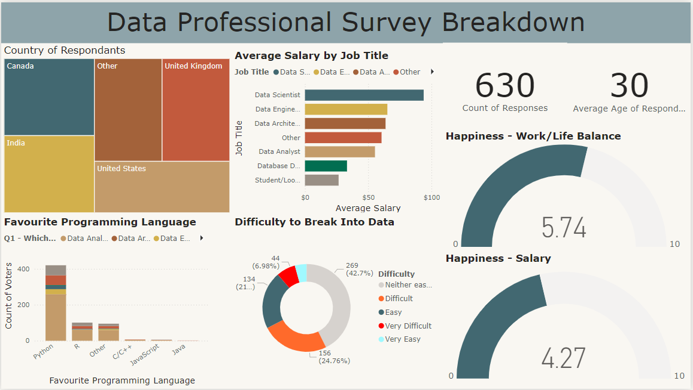

# Data Professional Survey Breakdown

## Table of Contents
- [Objective](#objective)
- [Survey Design](#survey-design)
  - [Tools Used](#tools-used)
  - [Survey Questions](#survey-questions)
- [Data Collection](#data-collection)
  - [Sampling Method](#sampling-method)
  - [Data Collection Process](#data-collection-process)
- [Data Cleaning](#data-cleaning)
  - [Power BI Data Cleaning Process](#power-bi-data-cleaning-process)
- [Analysis](#analysis)
  - [Exploratory Data Analysis](#exploratory-data-analysis)
- [Visualization](#visualization)
  - [Results](#results)
- [Findings](#findings)
- [Recommendations](#recommendations)
- [Conclusion](#conclusion)

---

## Objective

### What is the Key Pain Point?

The key pain point this survey aims to address is understanding the current challenges and opportunities for data professionals in terms of career progression, job satisfaction, salary expectations, and the tools they use.

### What is the Ideal Outcome?

The ideal outcome of this survey is to gather comprehensive insights into the work life of data professionals, their challenges, and the tools that are helping them achieve success in their careers. The results can be used to make informed decisions for improving career development, training programs, and tools selection.

### Survey Objective

The objectives of this survey are:
- To gather feedback on the tools data professionals use in their roles.
- To understand the common challenges faced by data professionals.
- To uncover career aspirations and expectations of data professionals.
- To determine the most sought-after skills and education for data professionals.

---

## Survey Design

### Tools Used

| Tool | Purpose |
| --- | --- |
| Power BI | Power BI was used to clean, analyze, and visualize the survey data. |

### Survey Questions

Here are the questions included in the survey:

1. **Which Title Best Fits your Current Role?**
2. **Did you switch careers into Data?**
3. **Current Yearly Salary (in USD)**
4. **What Industry do you work in?**
5. **Favorite Programming Language**
6. **How Happy are you in your Current Position with the following? (Salary)**
7. **How Happy are you in your Current Position with the following? (Work/Life Balance)**
8. **How Happy are you in your Current Position with the following? (Coworkers)**
9. **How Happy are you in your Current Position with the following? (Management)**
10. **How Happy are you in your Current Position with the following? (Upward Mobility)**
11. **How Happy are you in your Current Position with the following? (Learning New Things)**
12. **How difficult was it for you to break into Data?**
13. **If you were to look for a new job today, what would be the most important thing to you?**
14. **Male/Female?**
15. **Current Age**
16. **Which Country do you live in?**
17. **Highest Level of Education**
18. **Ethnicity**

---

## Data Collection

### Sampling Method

The survey was distributed to data professionals using the following sampling method:
- **Sampling Method**: Convenience sampling through online communities, LinkedIn groups, and email lists.
- **Target Audience**: Data scientists, analysts, engineers, and other data professionals.

### Data Collection Process

- **Platform Used**: Google Forms was used to distribute the survey.
- **Response Rate**: We aimed to gather at least 200 responses from data professionals.

---

## Data Cleaning

### Power BI Data Cleaning Process

The data cleaning process in Power BI included:
- **Handling Missing Data**: Missing values for categorical variables were filled using the mode (most frequent value), and missing values for numerical data were filled using the median.
- **Outlier Removal**: Outliers were detected using Power BI’s visualizations like box plots and histograms.
- **Data Transformation**: The dataset was transformed using Power BI’s built-in features, such as creating new calculated columns for aggregating responses.

---

## Analysis

### Exploratory Data Analysis

The exploratory data analysis (EDA) included:
- **Visualizations**: Bar charts, histograms, and scatter plots were used to analyze the data.
- **Initial Findings**: A significant proportion of survey respondents have a background in data science.
- A significant proportion of survey respondents' favourite programming language is Python.

## Visualization

### Results

The results were visualized using Power BI to create various charts and graphs to showcase key findings.

## Findings

Based on the analysis and visualizations, the following key findings were observed:
- **Career Transition**: Many respondents indicated they transitioned into data careers from non-technical backgrounds.
- **Salary Expectations**: There is a wide range of salaries across industries, with the technology sector offering the highest salaries on average.
- **Job Satisfaction**: The majority of respondents expressed satisfaction with their work-life balance but showed mixed feelings about salary and upward mobility.

- **Favorite Programming Language**: Python is the most popular language among data professionals, largely due to its versatility, ease of use, and extensive libraries for data analysis, machine learning, and AI.

- **Difficulty Breaking into Data**: Many respondents found it challenging to enter the data field, likely due to the competitive nature of the industry and the technical skills required for various roles.

- **High Earnings**: Data Scientists, Engineers, and Architects
Data scientists, engineers, and architects have the highest earning potential, with architects earning the most, followed by engineers and data scientists, reflecting the demand for specialized technical skills.

- **Good Work-Life Balance**: Respondents generally reported satisfaction with their work-life balance, likely influenced by flexible working conditions, such as remote work and adaptable hours in many data roles.

- **Low Job Happiness**: Despite good work-life balance, many respondents expressed low happiness related to salary, career growth, and other job satisfaction factors, indicating a need for improvement in these areas.

---

## Recommendations

### Invest in Skill Development and Training Programs

Recommendation: Given the difficulty in breaking into the data field, training programs or boot camps could be highly beneficial. Companies and educational institutions should develop tailored programs that help individuals build essential skills in programming, data analysis, and machine learning.
Action: Encouraging mentorship and internship opportunities could also help bridge the gap for newcomers, providing them with practical experience and connections in the industry.

### Focus on Compensation and Career Advancement

Recommendation: Companies should prioritize competitive compensation packages and clear paths for career growth to increase employee satisfaction. While work-life balance is crucial, employees also value fair compensation, career progression, and learning opportunities.
Action: Employers should consider implementing performance reviews that focus not only on technical achievements but also on professional development and upward mobility, ensuring that employees feel valued and have the potential for growth.

### Leverage the Popularity of Python

Recommendation: Since Python is the most favored programming language among data professionals, organizations should invest in training and upskilling their employees in Python-related tools and frameworks to ensure their teams remain highly proficient.
Action: Companies should also consider expanding Python-based projects or integrating Python into their workflows to maximize the benefits of its widespread adoption.

### Improve Employee Satisfaction and Happiness

Recommendation: Employers should take a closer look at factors affecting job satisfaction beyond work-life balance, such as salary, management practices, and upward mobility.
Action: Conducting regular employee surveys, offering mentorship programs, and focusing on transparent communication regarding promotions and salary increases could address many of the concerns that contribute to low happiness levels.

---

## Conclusion

While data professionals enjoy a good work-life balance, other aspects of their job, such as salary, career advancement, and overall job satisfaction, require improvement. The survey highlights the challenges faced by individuals trying to break into the data field and underscores the high earning potential for roles like data scientists, engineers, and architects. Python remains the top programming language of choice, reinforcing its importance in the data ecosystem.

By investing in skill development, improving compensation packages, and addressing concerns around career progression and management, companies can enhance job satisfaction and retain top talent in the competitive data field.
